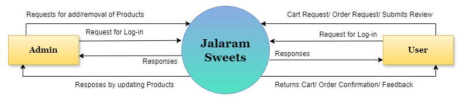
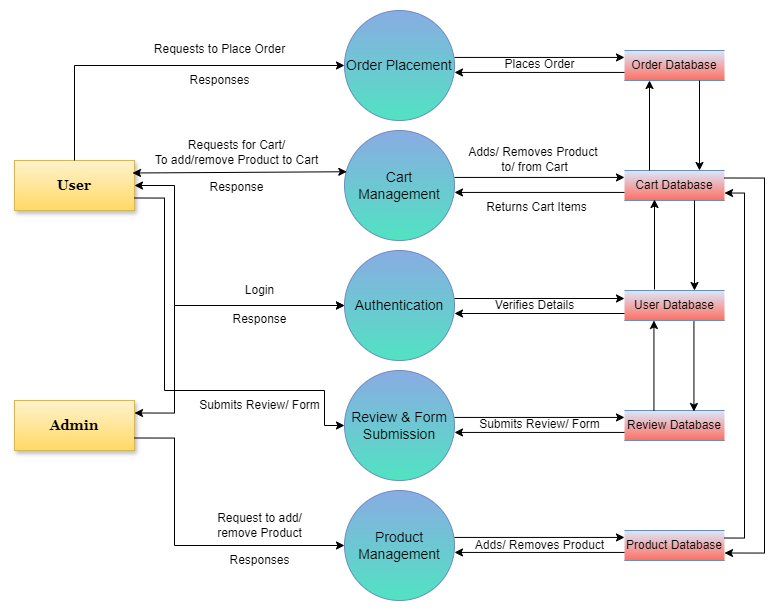
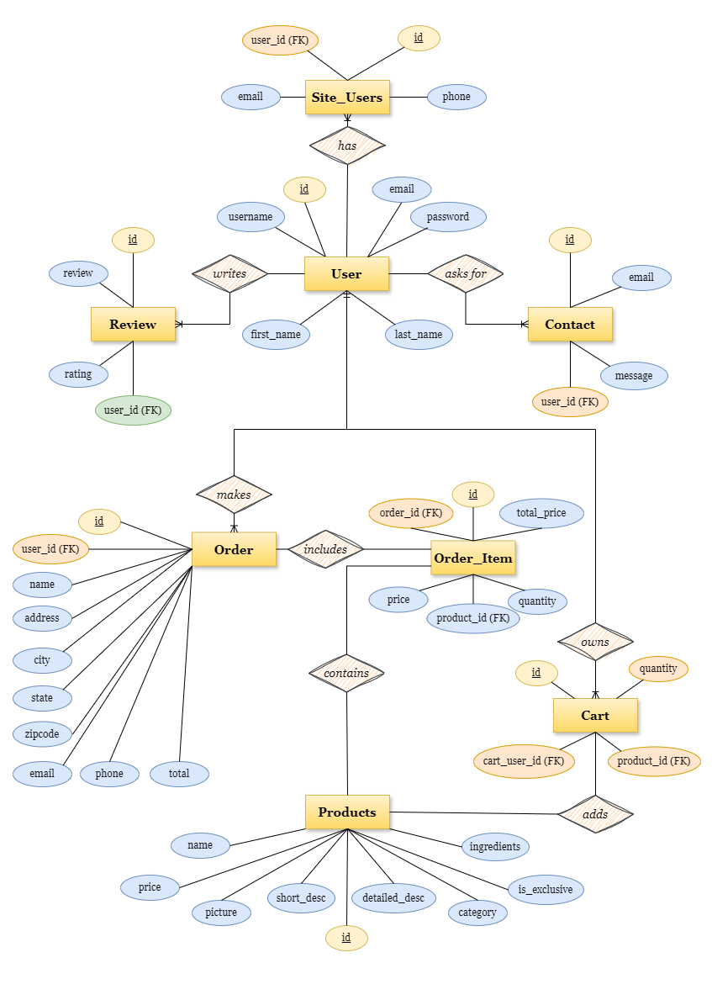

# Jalaram Sweets – Django E-Commerce Platform

> “Every Sweet Tells a Story”

Jalaram Sweets is a full-stack e-commerce web application built using Django.  
The platform allows users to browse, filter, and purchase traditional and fusion sweets through an interactive and responsive interface.

---

## Features

### **For Customers**

* **Intuitive Product Catalog:** Browse sweets categorized into sections like Traditional Classics, Barfis, and Chocolate Specialties.


* **Dynamic Cart Management:** Add items to a virtual cart, update quantities, or remove products with real-time feedback powered by JavaScript.


* **Secure Checkout:** A streamlined process to enter delivery details and review order summaries before final placement.

* **Deep Storytelling:** Each product features a "Story Behind" section, highlighting the cultural significance and heritage of the sweet.


* **Sorting & Filtering:** Easily locate items by price (Low-High/High-Low) or alphabetically (A-Z/Z-A).


### **For Administrators**

* **Role-Based Access Control:** Secure superuser access to manage the entire store inventory.


* **Inventory Management:** Admin dashboard to add new products, update prices, modify descriptions, or remove discontinued items.


---

## Tech Stack

* **Backend:** Python & Django Framework 


* **Frontend:** HTML5, CSS3, JavaScript 


* **Database:** Django ORM (handling User Profiles, Products, Cart, and Orders) 


---

## System Architecture

The project follows Django’s **Model-View-Template (MVT)** architecture:

- **Models:** Handle database structure and ORM interactions.
- **Views:** Process user requests and implement business logic.
- **Templates:** Render dynamic HTML content for the frontend.

This layered architecture ensures scalability, maintainability, and separation of concerns.

---

## Mobile Responsiveness

The platform is designed to be fully responsive, ensuring a high-quality shopping experience across both desktop and mobile devices.

---


## Installation Instructions

To get **Jalaram Sweets** running locally on your machine, follow these steps:

### **1. Prerequisites**

* Ensure you have **Python** installed.


* Install **Django** (the high-level Python web framework used for this project).


### **2. Setup Environment**

1. **Clone the repository:**
```bash
git clone https://github.com/ViralKariya-VK/Jalaram-Sweets.git
cd JalaramSweets
```


2. **Install dependencies:**
```bash
pip install -r requirements.txt
```

### **3. Database Configuration**

This project uses Django's **Object-Relational Mapping (ORM)** system.

1. **Run migrations** to create the database schema (User, Products, Orders, etc.):
```bash
python manage.py makemigrations
python manage.py migrate
```


2. **Create a superuser** to access the Admin dashboard:

```bash
python manage.py createsuperuser
```


### **4. Launch the Application**

1. **Start the development server:**
```bash
python manage.py runserver
```


2. Open your browser and navigate to `http://127.0.0.1:8000/`.

---

## Usage Guide

### **For Customers**

* **Explore:** Use the **Home Page** or **Sweets Library** to view the curated catalog of sweets and snacks.


* **Filter/Sort:** Use the dropdown menus to find products by category or sort them by price and name.


* **Account Creation:** Click **Sign Up** to create a new account by providing your username, email, and contact number.


* **Shopping:**
1. Click **Add to Cart** on any item.


2. Visit the **Cart Page** to review quantities and totals.


3. Click **Proceed to Checkout** to enter your delivery address.


4. Confirm your purchase by clicking **Place Order**.


* **Order Confirmation:** View your order summary on the **Order Detail** page.


### **For Administrators**

* **Secure Login:** Access the platform using superuser credentials.


**Inventory Control:**
* **Add Products:** Use the **Add Product** icon to fill out a form with a product's name, category, price, description, and image.


* **Remove Products:** Use the **Remove Product** option in the Sweets Library to instantly delete items from the catalog.

* **System Management:** Use the Django Admin backend to oversee user profiles, order history, and customer reviews.

----

## References

- Django Official Documentation
- Python Documentation
- MDN Web Docs
- Draw.io (ER & DFD Diagrams)
- GeeksforGeeks
- Flaticon

---

## License

This project is for academic and educational purposes.

----
## System Diagrams


### DFD Level 0



---

### DFD Level 1



---

### ER Diagram



----
